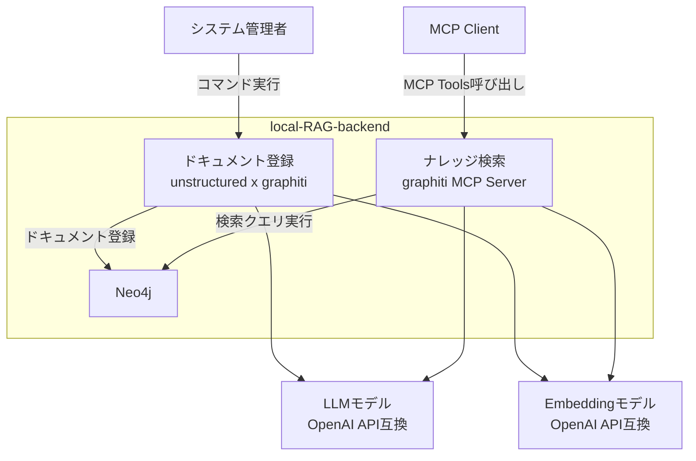
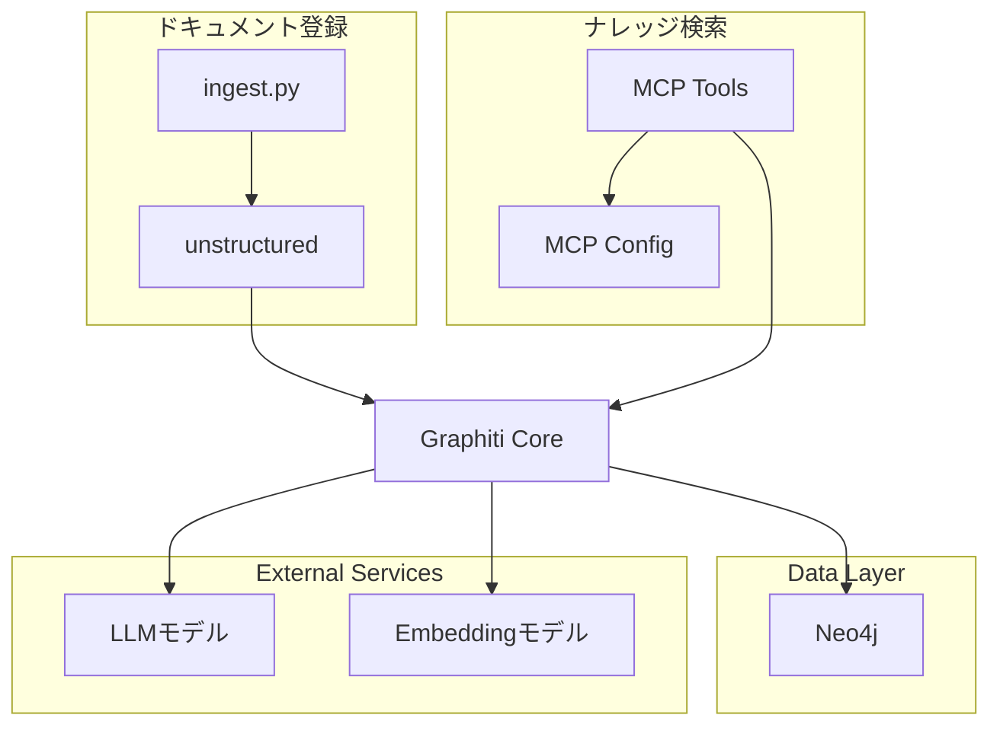
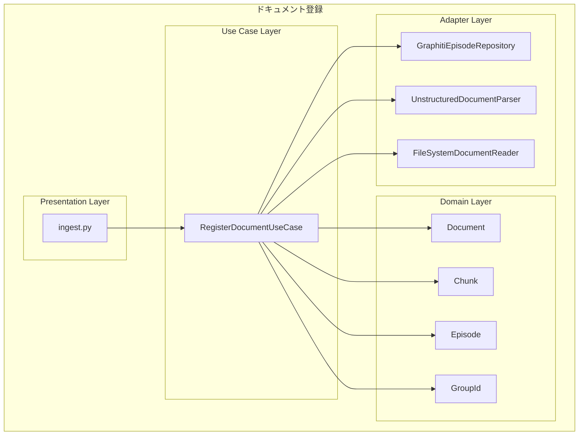
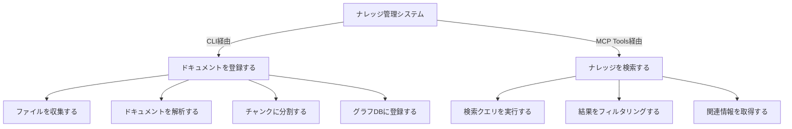
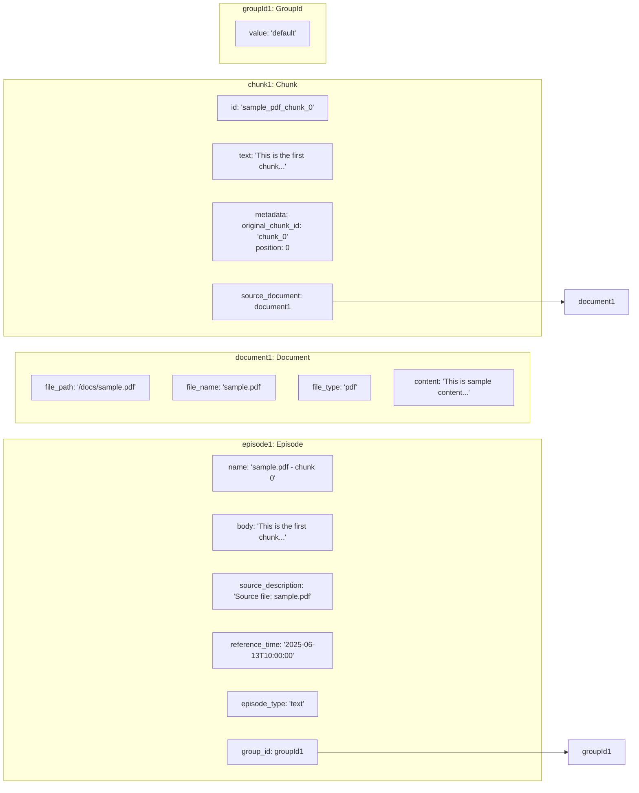
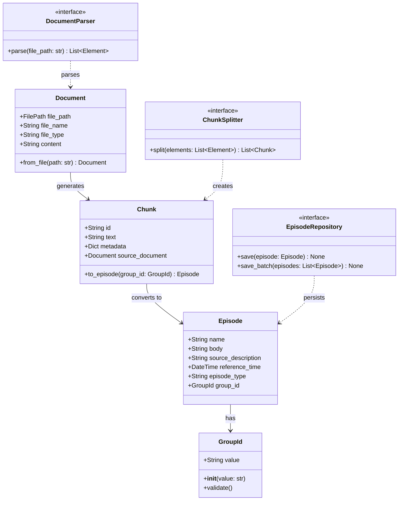
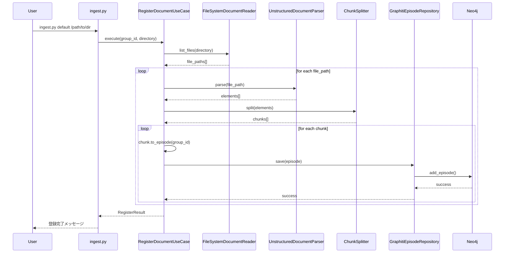
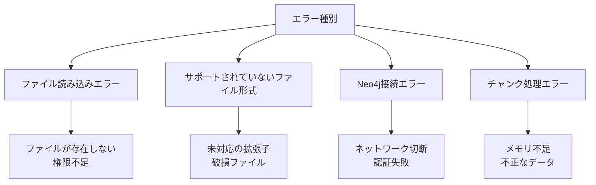

# DEVELOPER.md

開発者向け詳細ドキュメント - local-RAG-backendシステムの設計・実装・運用に関する包括的な情報

## システムアーキテクチャ

### システムコンテキスト図



| 要素名                         | 責務                 | 通信方式               | 機能                       |
| ------------------------------ | -------------------- | ---------------------- | -------------------------- |
| システム管理者                 | ドキュメント管理     | コマンドライン         | CLIでドキュメント登録      |
| MCP Client                     | 検索クライアント     | MCP Protocol           | MCP Toolsでナレッジ検索    |
| ingest                         | 登録処理システム     | 直接ライブラリ呼び出し | 文書解析・チャンク化・登録 |
| MCP Server                     | 検索インターフェース | MCP Tools              | 8つのツールで検索・管理    |
| Neo4j                          | データ永続化         | Bolt Protocol          | グラフDB・ベクトルDB       |
| LLMモデル OpenAI API互換       | LLM処理              | HTTP/HTTPS             | 構造化・リランク           |
| Embeddingモデル OpenAI API互換 | Embedding生成        | HTTP/HTTPS             | ベクトル化                 |

### コンテナ図



### コンポーネント図 / ドキュメント登録



## ユーザーストーリーマッピング (USM)



| レベル       | 要素                     | 説明                         | 実装                       |
| ------------ | ------------------------ | ---------------------------- | -------------------------- |
| **システム** | ナレッジ管理システム     | 文書登録と検索の統合システム | local-RAG-backend          |
| **エピック** | ドキュメントを登録する   | CLIによるドキュメント登録    | ingest.py                  |
|              | ファイルを収集する       | 対象ファイルの探索と選別     | FileSystemDocumentReader   |
|              | ドキュメントを解析する   | ファイル内容の構造化         | UnstructuredDocumentParser |
|              | チャンクに分割する       | 適切なサイズへの分割         | ChunkSplitter              |
|              | グラフDBに登録する       | Neo4jへのデータ保存          | GraphitiEpisodeRepository  |
| **エピック** | ナレッジを検索する       | MCP Toolsによる検索          | MCP Server                 |
|              | 検索クエリを実行する     | 自然言語での検索             | search_memory_facts        |
|              | 結果をフィルタリングする | 権限・件数での絞り込み       | group_ids, max_facts       |
|              | 関連情報を取得する       | 詳細・関連情報の取得         | get_entity_edge            |

## アプリケーションアーキテクチャ

登録機能はDDD、検索機能は公式MCP Server実装を流用した2つのアーキテクチャを組み合わせています。

### ドキュメント登録

ドキュメント登録はDDD（ドメイン駆動設計）に基づいた層構造を採用しています。

**レイヤー構造:**

1. **プレゼンテーション層** (`src/main/`)

   - CLIエントリーポイント
   - ユーザーインターフェース

2. **ユースケース層** (`src/usecase/`)

   - アプリケーションのビジネスロジック
   - ドメインモデルの調整

3. **ドメイン層** (`src/domain/`)

   - ビジネスルールとエンティティ
   - 値オブジェクト

4. **リポジトリ層** (`src/repository/`)

   - データ永続化のインターフェース

5. **アダプター層** (`src/adapter/`)
   - 外部サービスとの連携実装
   - リポジトリの具体的実装

### ナレッジ検索

ナレッジ検索は、公式のMCP（Model Context Protocol）Serverから、LLM modelとEmbedding modelの設定を分離できるようにしています。

## 設定

### 環境変数

```ini
# LLM設定（ドキュメント登録・検索共通）
LLM_MODEL_URL=https://api.openai.com/v1
LLM_MODEL_KEY=sk-xxx
LLM_MODEL_NAME=gpt-4o-mini
RERANK_MODEL_NAME=gpt-4.1-nano

# Embedding設定（ドキュメント登録・検索共通）
EMBEDDING_MODEL_URL=http://ollama:11434/v1
EMBEDDING_MODEL_KEY=dummy
EMBEDDING_MODEL_NAME=kun432/cl-nagoya-ruri-large:latest

# Neo4j設定（共通データベース）
NEO4J_URI=bolt://neo4j:7687
NEO4J_USER=neo4j
NEO4J_PASSWORD=password

# テナント設定
GROUP_ID=default
```

## 仕様 / ドキュメント登録

### サポートファイルタイプ

Documentクラスは、Unstructured.io公式サポートに基づいて以下のファイルタイプをサポートしています：

**参考**: [Unstructured.io - Supported File Types](https://docs.unstructured.io/open-source/introduction/supported-file-types)

| カテゴリ             | ファイルタイプ                       | 説明                           |
| -------------------- | ------------------------------------ | ------------------------------ |
| **テキスト**         | txt, md, rst, org                    | プレーンテキスト、マークダウン |
| **Web**              | html, xml                            | ウェブページ、構造化文書       |
| **PDF**              | pdf                                  | Adobe PDF文書                  |
| **Microsoft Office** | doc, docx, ppt, pptx, xls, xlsx      | Word、PowerPoint、Excel        |
| **OpenDocument**     | odt                                  | OpenOffice/LibreOffice文書     |
| **リッチテキスト**   | rtf                                  | Rich Text Format               |
| **eBook**            | epub                                 | 電子書籍                       |
| **データ**           | csv, tsv                             | カンマ区切り、タブ区切りデータ |
| **メール**           | eml, msg, p7s                        | メールメッセージ、暗号化メール |
| **画像**             | bmp, heic, jpeg, jpg, png, tiff, tif | 各種画像形式（OCR処理対象）    |

**総計**: 28種類のファイルタイプをサポート

### ドメインモデル図（オブジェクト図）



### クラス図



### シーケンス図



### 設計上の考慮事項

#### ファイルタイプサポート設計

**設計方針**

1. **外部ライブラリ準拠**: Unstructured.ioの公式サポートに基づく
2. **一元管理**: `Document.SUPPORTED_FILE_TYPES`で集中管理
3. **拡張性**: セット型で新しいファイルタイプの追加が容易
4. **バリデーション**: 初期化時にサポート外ファイルタイプを検証

**技術的根拠**

- **参考資料**: [Unstructured.io - Supported File Types](https://docs.unstructured.io/open-source/introduction/supported-file-types)
- **実装場所**: `src/domain/document.py:SUPPORTED_FILE_TYPES`
- **テスト保証**: 代表的なファイルタイプの動作確認済み
- **総サポート数**: 28種類のファイルタイプ

**将来的な拡張**

```python
# 新しいファイルタイプの追加例
SUPPORTED_FILE_TYPES.add("new_format")
```

#### エラーハンドリング



#### パフォーマンス考慮事項

| 項目                   | 対策                       | 説明                           |
| ---------------------- | -------------------------- | ------------------------------ |
| 大量ファイルの並行処理 | 非同期処理・スレッドプール | 複数ファイルの同時処理で高速化 |
| バッチ登録による効率化 | save_batch メソッド        | 複数エピソードを一括登録       |
| メモリ使用量の最適化   | ストリーミング処理         | 大きなファイルも段階的に処理   |

### パフォーマンス最適化の知見

#### LLM API選択指針

以下は実際の性能測定に基づく知見です。新しいLLMサービスを検討する際の参考にしてください。

**実証済み最適解**

```ini
# 最高性能・最安定の構成（実測）
LLM_MODEL_URL=https://api.openai.com/v1    # 直接接続
LLM_MODEL_NAME=gpt-4o-mini                # 1.57秒/回、高精度
```

**避けるべき構成（実測済み問題）**

```ini
# 問題のある構成例
LLM_MODEL_URL=http://localhost:4000/v1     # claude-code-server（極度の遅延）
LLM_MODEL_URL=http://localhost:11434/v1    # ollama gemma3/4b（遅延・エラー頻発）
LLM_MODEL_URL=https://openrouter.ai/api/v1 # rate limit・フォーマットエラー
```

#### フォーマットエラーの原因と対策

**主要な原因**

1. **Rate Limit**: OpenRouterで高負荷時にフォーマットエラー頻発
2. **モデル品質**: ローカルLLM（ollama gemma2/4b）で不定期エラー
3. **接続不安定**: ネットワーク経由のAPIゲートウェイ

**対策**

- **直接API接続**: 中間層を避けて安定性確保
- **高品質モデル**: structured outputに対応した実績あるモデル選択
- **エラーハンドリング**: 一部失敗でも処理継続する設計

#### 並列処理の最適化

**ワーカー数の指針**

- **3ワーカー**: 標準構成（実測50秒）
- **5ワーカー**: 微改善のみ（実測49秒、1秒短縮）
- **最適値**: ワーカー数 ≤ ファイル数

**実測値（7ファイル処理 - 2025-06-15更新）**

- **総実行時間**: 381秒（6分21秒）
- **LLM処理**: 21.0%（80秒、平均1.11秒/回、72回）
- **Embedding処理**: 79.0%（301秒、平均4.56秒/回、66回）- 現在のボトルネック
- **成功率**: 100%（PNG画像含む全ファイル形式対応済み）

## 仕様 / ナレッジ検索

### MCP Server実装詳細

**実装方式**: FastMCP（mcp.server.fastmcp.FastMCP）
**トランスポート**: SSE（Server-Sent Events）固定
**エンドポイント**: `http://localhost:8000/sse`

### 接続確認済みクライアント

✅ **n8n.AI Agent**: 動作確認済み（推奨）
❌ **直接Pythonクライアント**: 技術的制約（起動時のハンドシェイクでエラー）で実現できない
✅ **統合環境**: `make docker-up`でNeo4j + MCP Server起動

### 主要検索Tools

| Tool                  | 機能           | 用途                 | n8n.AI Agent使用例 |
| --------------------- | -------------- | -------------------- | ------------------ |
| `search_memory_facts` | 事実検索       | メイン検索機能       | 質問回答の情報取得 |
| `search_memory_nodes` | ノード検索     | 関連エンティティ検索 | 詳細情報の関連取得 |
| `get_entity_edge`     | 個別事実取得   | 特定情報の詳細確認   | ファクトの詳細表示 |
| `get_episodes`        | エピソード一覧 | 最新情報確認         | 時系列情報の取得   |

### 管理・運用Tools

| Tool                 | 機能           | 用途           |
| -------------------- | -------------- | -------------- |
| `add_memory`         | エピソード追加 | 動的情報追加   |
| `delete_entity_edge` | 事実削除       | 情報削除       |
| `clear_graph`        | グラフクリア   | データリセット |

### 環境変数マッピング（実装済み）

MCP Serverでは以下の環境変数マッピングが自動実行される：

```python
# LLM API統合
LLM_MODEL_KEY → OPENAI_API_KEY   # GraphitiライブラリとOpenAIライブラリ互換性
NEO4J_URL → NEO4J_URI           # URL/URI命名統一
LLM_MODEL_NAME → MODEL_NAME     # プレフィックス統一
RERANK_MODEL_NAME → SMALL_MODEL_NAME    # 用途別名前統一
EMBEDDING_MODEL_NAME → EMBEDDER_MODEL_NAME  # 命名統一
```

## 開発・運用

### ディレクトリ構成

```
local-RAG-backend/
├── src/                        # アプリケーションコード
│   ├── main/                   # プレゼンテーション層
│   ├── usecase/                # ユースケース層
│   ├── domain/                 # ドメイン層
│   └── adapter/                # アダプター層
├── mcp_server/                 # MCP Server（検索機能）
├── data/                       # Dockerボリューム用（.gitignore対象）
│   ├── input/                  # ドキュメント投入ディレクトリ
│   ├── logs/                   # 実行ログ
│   └── neo4j/                  # Neo4jデータ永続化
├── tests/                      # テストコード
│   ├── domain/                 # ドメイン層テスト
│   ├── usecase/                # ユースケース層テスト
│   ├── adapter/                # アダプター層テスト
│   ├── main/                   # プレゼンテーション層テスト
│   └── integration/            # 統合テスト
├── fixtures/                   # テストデータ
├── scripts/                    # 開発・運用支援スクリプト
├── .env                        # 環境変数
├── docker-compose.yml          # 利用者向け統合環境
├── docker-compose.dev.yml      # 開発者向け最小環境
├── Dockerfile                  # Ingestサービス用
├── CLAUDE.md                   # Claude Code用ガイダンス
├── DEVELOPER.md                # 開発者向け詳細ドキュメント
├── README.md                   # ユーザー向けドキュメント
├── Makefile                    # 開発・運用コマンド
├── pyproject.toml              # Python設定（rye管理）
└── tmp/                        # 一時ファイル・作業用
```

### 開発規約

#### テスト駆動開発（TDD）

1. テストファーストで実装
2. レッドフェーズ → グリーンフェーズ → リファクタリング
3. カバレッジ目標: 80%以上

#### コード品質

- qltyによる自動チェックを通過すること
- 型ヒントを必ず使用
- docstringでクラス・メソッドを文書化

**品質チェック除外事項**

以下の警告は開発方針として許容する：

- `bandit:B101` - pytestでのassert使用（テストフレームワークの標準的な使用方法）
- `radarlint-python:python:S100` - テストメソッドの日本語命名（BDD仕様に従った命名）

#### Git運用

- mainブランチへの直接プッシュは禁止
- 機能ブランチで開発し、PRでマージ
- コミットメッセージはconventional commitに従う

### 環境構築手順

#### 利用者向け（Docker環境）

1. リポジトリのクローン
2. `.env` ファイルの作成（`.env.example`を参考）
3. `docker compose up -d` で統合環境起動（Neo4j + MCP Server）
4. `docker compose run --rm ingest` でドキュメント登録

#### 開発者向け（ローカル環境）

1. リポジトリのクローン
2. `rye sync` で依存関係インストール
3. `docker compose -f docker-compose.dev.yml up -d` でNeo4j起動
4. `.env` ファイルの作成（`.env.example`を参考）
5. `rye run python -m src.main.ingest` で開発・テスト

### よく使うコマンド

```bash
# フォーマット
qlty fmt

# テスト実行
rye run pytest

# カバレッジ確認
rye run pytest --cov=src --cov-report=html

# 品質チェック
qlty check
qlty smells
qlty metrics

# Neo4j起動/停止
docker compose up -d -f docker-compose.dev.yml
docker compose down -f docker-compose.dev.yml
```

## 最近の改善実績と今後の計画

### 2025-06-15 解決済み課題

#### 1. 画像処理エラー対応（✅ 完了）

- **問題**: PNG画像で`libGL.so.1: cannot open shared object file`エラー
- **解決**: 公式Unstructured.io Dockerイメージ（quay.io/unstructured-io/unstructured:0.17.9）採用
- **効果**: PNG含む全28種類のファイル形式で100%成功率達成

#### 2. Rate Limit自動リトライ（✅ 完了）

- **問題**: OpenAI APIのrate limitで処理中断
- **解決**: RateLimitRetryHandlerクラス実装
  - 最大3回リトライ
  - retry-afterヘッダー自動解析
  - 適切な待機時間設定
- **効果**: Rate limitエラーでの処理継続を実現

#### 3. 並列処理IndexError対応（✅ 完了）

- **問題**: `list index out of range`エラー（エンティティ競合）
- **解決**: 指数バックオフリトライ実装
- **効果**: 並列処理時の競合状態を解決

#### 4. NumPy互換性問題（✅ 完了）

- **問題**: NumPy 2.x とPyTorch/ONNXの非互換
- **解決**: `numpy<2.0.0` 制約追加
- **効果**: 警告メッセージ完全解消

#### 5. Neo4jインデックス不備（✅ 完了）

- **問題**: 手動でのインデックス作成が必要
- **解決**: `build_indices_and_constraints()`自動実行
- **効果**: セットアップの自動化

#### 6. タイムスタンプ機能改善（✅ 完了）

- **問題**: エピソードタイムスタンプが処理実行時の現在時刻だった
- **解決**: ファイルの最終更新日時を使用するように変更
- **効果**:
  - 意味のある時系列追跡が可能
  - 同一ファイルのチャンクが同じタイムスタンプを持つ
  - graphitiの時系列関係性追跡でドキュメントの実際の時間軸が反映

### 今後の計画

#### A. 短期改善項目

- **ナレッジ検索の可視化**

  - 検索の内部でなにが起きているかがわかりにくい

    - graphitiのログには出力されている
    - カスタムログハンドラー経由でlangfuse連携して内部の挙動をモニタリング
    - イメージ

      - Langfuse統合ハンドラー

        ```py
        import logging
        from langfuse import Langfuse
        from langfuse.decorators import observe

        class LangfuseHandler(logging.Handler):
            def __init__(self):
                super().__init__()
                self.langfuse = Langfuse()

            def emit(self, record):
                # LLMリクエスト/レスポンスの検出
                if hasattr(record, 'llm_request') or hasattr(record, 'embedding_request'):
                    self._trace_llm_call(record)

            def _trace_llm_call(self, record):
                # Langfuseへのトレース送信ロジック
                pass
        ```

      - ログレコードの拡張

        ```py
        # カスタムフィルターでログレコードを拡張
        class LLMContextFilter(logging.Filter):
            def filter(self, record):
                # スタックトレースから呼び出し元を特定
                if 'generate_response' in record.funcName:
                    record.llm_request = True
                    record.model_info = self._extract_model_info(record)
                elif 'embedder.create' in str(record.getMessage()):
                    record.embedding_request = True
                return True
        ```

      - 統合の実装 openai_client.py:31 で使用されているloggerに対してハンドラーを追加：

        ```py
        # 初期化時に設定
        llm_logger = logging.getLogger('graphiti_core.llm_client.openai_client')
        search_logger = logging.getLogger('graphiti_core.search.search')

        langfuse_handler = LangfuseHandler()
        llm_context_filter = LLMContextFilter()

        llm_logger.addHandler(langfuse_handler)
        llm_logger.addFilter(llm_context_filter)
        search_logger.addHandler(langfuse_handler)
        ```

## ファイル位置による状態管理

### 基本方針

```
data/input/  : 未処理ファイル
data/input_work/   : エピソード登録中（エピソードファイル保存済み）
data/input_done/   : 処理完了ファイル
```

### 処理フロー

#### Phase 1: チャンク分割（ファイル単位で並列）

```
1. ファイル読み込み（data/input/）
2. チャンク生成・エピソード変換（メモリ上）
3. エピソードファイル保存（data/input_chunks/）
4. ファイル移動（data/input/ → data/input_work/）
```

#### Phase 2: エピソード登録（エピソード単位で並列）

```
1. エピソードファイル読み込み
2. Neo4j登録
3. エピソードファイル削除（成功時）
4. 空チェック → ファイル移動（data/input_work/ → data/input_done/）
```

### 並列処理の考慮

- **チャンク分割**: ファイル単位で並列
- **エピソード登録**: エピソード単位で並列
- **ファイル移動**: 各スレッド内で独立実行（競合回避）

### 🚨 解決される問題

1. **DB重複問題の完全解決**

   - エピソード保存進捗があるファイルの再処理で重複が発生する問題を解消
   - ファイル位置とエピソードファイルで状態が明確

2. **状態管理の簡素化**

   - 進捗ファイル不要
   - ファイルの場所 = 処理状態

3. **エラー復旧の確実性**
   - input_work/内の残存エピソードファイルから確実に再開

## 📋 実装詳細

### 1. ディレクトリ構造

```
data/
├── input/              # 未処理ファイル
│   └── subdir/
│       └── document.pdf
├── input_work/         # 処理中ファイル
│   └── subdir/
│       └── document.pdf
├── input_done/         # 完了ファイル
│   └── subdir/
│       └── document.pdf
└── input_chunks/       # エピソードファイル
    └── {file_hash}/
        ├── episode_0.json
        ├── episode_1.json
        └── ...
```

### 3. エラー復旧シナリオ

#### ケース1: チャンク生成中のエラー

- ファイルは`input/`に残る
- 再実行時に最初から処理

#### ケース2: エピソード登録中のエラー

- ファイルは`input_work/`に存在
- 残存エピソードファイルから再開
- 成功分は削除済みなので重複なし

#### ケース3: 全処理完了

- ファイルは`input_done/`に移動
- エピソードファイルは全削除済み
