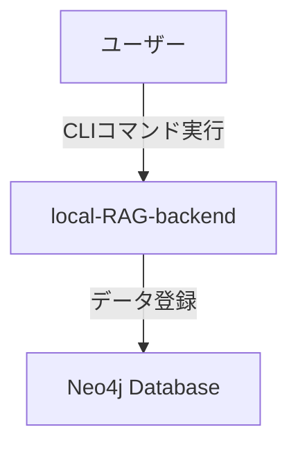
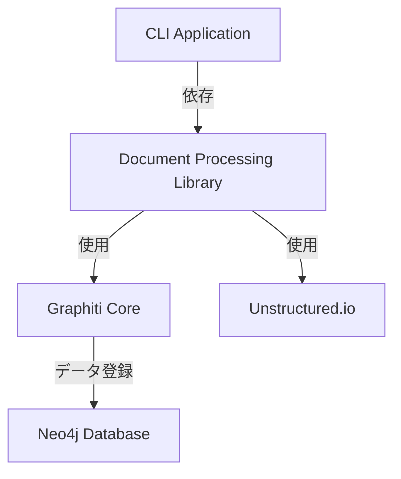
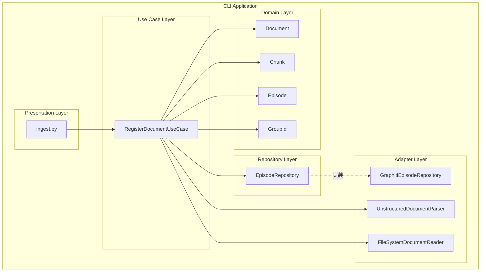
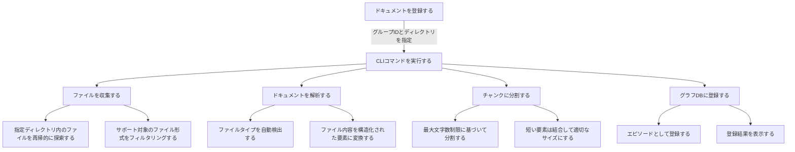
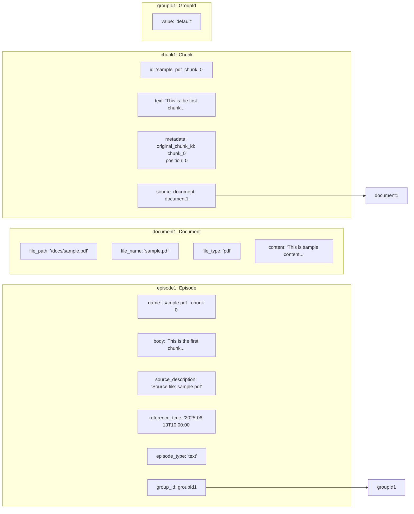
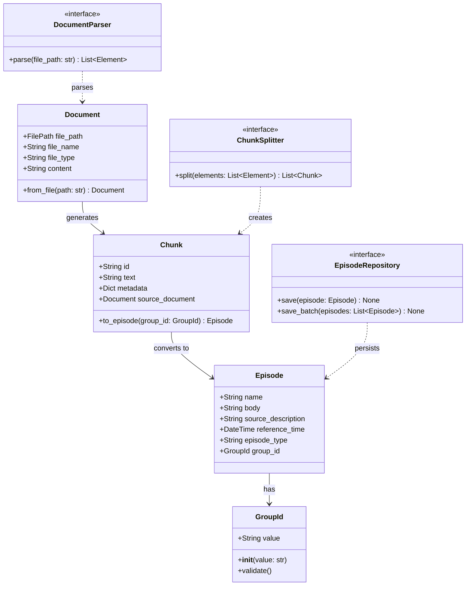
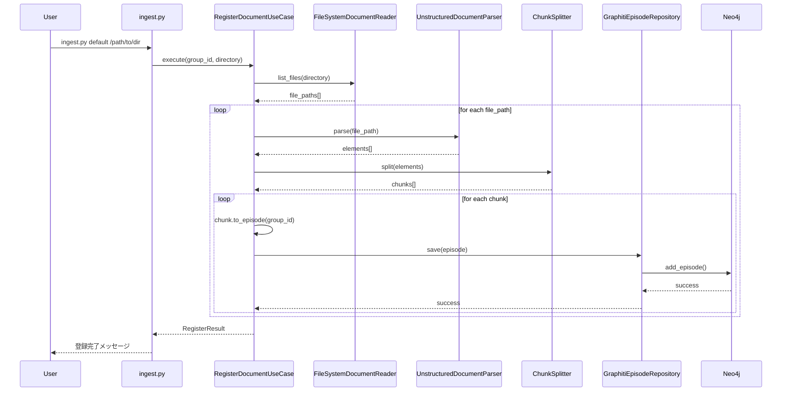
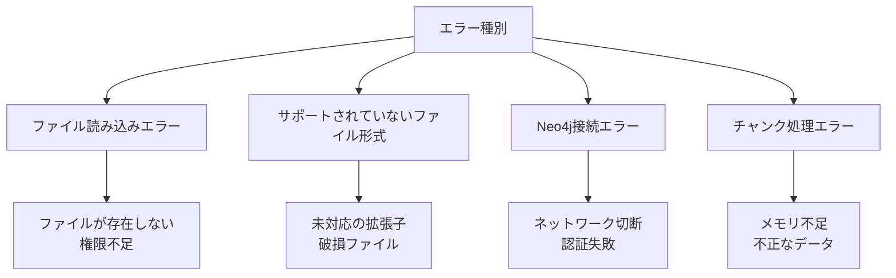
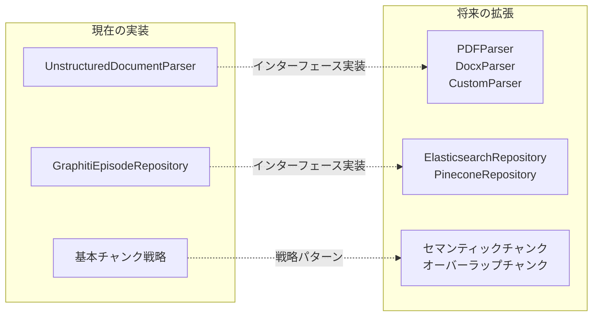

# DEVELOPER.md

- v0.1.0 登録機能の設計時点

## C4モデル

### Level 1: System Context



| 要素名            | 説明                                              |
| ----------------- | ------------------------------------------------- |
| ユーザー          | CLIコマンドを実行してドキュメントを登録する利用者 |
| local-RAG-backend | ローカルRAGシステムのバックエンド                 |
| Neo4j Database    | グラフデータベース（ベクトルDB）                  |

### Level 2: Container



| 要素名                      | 説明                                    |
| --------------------------- | --------------------------------------- |
| CLI Application             | ingest.pyコマンドラインインターフェース |
| Document Processing Library | ドキュメント処理のコアライブラリ        |
| Graphiti Core               | グラフDBとの連携ライブラリ              |
| Unstructured.io             | ドキュメント解析ライブラリ              |
| Neo4j Database              | グラフデータベース                      |

### Level 3: Component



| 要素名                     | 説明                               |
| -------------------------- | ---------------------------------- |
| ingest.py                  | CLIエントリーポイント              |
| RegisterDocumentUseCase    | ドキュメント登録のユースケース     |
| Document                   | 文書エンティティ                   |
| Chunk                      | チャンクエンティティ               |
| Episode                    | エピソード値オブジェクト           |
| GroupId                    | グループID値オブジェクト           |
| EpisodeRepository          | エピソード保存のインターフェース   |
| GraphitiEpisodeRepository  | Graphitiを使用したリポジトリ実装   |
| UnstructuredDocumentParser | Unstructuredを使用した文書解析     |
| FileSystemDocumentReader   | ファイルシステムからの文書読み込み |

## ユーザーストーリーマッピング (USM)

### エピック: ドキュメント登録



| レベル | 要素                   | 説明                     |
| ------ | ---------------------- | ------------------------ |
| 活動   | ドキュメントを登録する | ユーザーの最終目的       |
| タスク | CLIコマンドを実行する  | コマンドラインからの実行 |
| 処理   | ファイルを収集する     | 対象ファイルの探索と選別 |
| 処理   | ドキュメントを解析する | ファイル内容の構造化     |
| 処理   | チャンクに分割する     | 適切なサイズへの分割     |
| 処理   | グラフDBに登録する     | Neo4jへのデータ保存      |

## アプリケーションアーキテクチャ

本プロジェクトはDDD（ドメイン駆動設計）に基づいた層構造を採用しています。

### レイヤー構造

1. **プレゼンテーション層** (`src/main/`)

   - CLIエントリーポイント
   - ユーザーインターフェース

2. **ユースケース層** (`src/usecase/`)

   - アプリケーションのビジネスロジック
   - ドメインモデルの調整

3. **ドメイン層** (`src/domain/`)

   - ビジネスルールとエンティティ
   - 値オブジェクト

4. **リポジトリ層** (`src/repository/`)

   - データ永続化のインターフェース

5. **アダプター層** (`src/adapter/`)
   - 外部サービスとの連携実装
   - リポジトリの具体的実装

## ドメインモデル

### サポートファイルタイプ

Documentクラスは、Unstructured.io公式サポートに基づいて以下のファイルタイプをサポートしています：

**参考**: [Unstructured.io - Supported File Types](https://docs.unstructured.io/open-source/introduction/supported-file-types)

| カテゴリ             | ファイルタイプ                       | 説明                           |
| -------------------- | ------------------------------------ | ------------------------------ |
| **テキスト**         | txt, md, rst, org                    | プレーンテキスト、マークダウン |
| **Web**              | html, xml                            | ウェブページ、構造化文書       |
| **PDF**              | pdf                                  | Adobe PDF文書                  |
| **Microsoft Office** | doc, docx, ppt, pptx, xls, xlsx      | Word、PowerPoint、Excel        |
| **OpenDocument**     | odt                                  | OpenOffice/LibreOffice文書     |
| **リッチテキスト**   | rtf                                  | Rich Text Format               |
| **eBook**            | epub                                 | 電子書籍                       |
| **データ**           | csv, tsv                             | カンマ区切り、タブ区切りデータ |
| **メール**           | eml, msg, p7s                        | メールメッセージ、暗号化メール |
| **画像**             | bmp, heic, jpeg, jpg, png, tiff, tif | 各種画像形式（OCR処理対象）    |

**総計**: 28種類のファイルタイプをサポート

### ドメインモデル図（オブジェクト図）



### クラス図



## シーケンス図



## 設計上の考慮事項

### ファイルタイプサポート設計

#### 設計方針

1. **外部ライブラリ準拠**: Unstructured.ioの公式サポートに基づく
2. **一元管理**: `Document.SUPPORTED_FILE_TYPES`で集中管理
3. **拡張性**: セット型で新しいファイルタイプの追加が容易
4. **バリデーション**: 初期化時にサポート外ファイルタイプを検証

#### 技術的根拠

- **参考資料**: [Unstructured.io - Supported File Types](https://docs.unstructured.io/open-source/introduction/supported-file-types)
- **実装場所**: `src/domain/document.py:SUPPORTED_FILE_TYPES`
- **テスト保証**: 代表的なファイルタイプの動作確認済み
- **総サポート数**: 28種類のファイルタイプ

#### 将来的な拡張

```python
# 新しいファイルタイプの追加例
SUPPORTED_FILE_TYPES.add("new_format")
```

### エラーハンドリング



### パフォーマンス考慮事項

| 項目                   | 対策                       | 説明                           |
| ---------------------- | -------------------------- | ------------------------------ |
| 大量ファイルの並行処理 | 非同期処理・スレッドプール | 複数ファイルの同時処理で高速化 |
| バッチ登録による効率化 | save_batch メソッド        | 複数エピソードを一括登録       |
| メモリ使用量の最適化   | ストリーミング処理         | 大きなファイルも段階的に処理   |

### 拡張性の設計



## ディレクトリ構成

### プロジェクト全体構成

```
local-RAG-backend/
├── src/                    # アプリケーションコード
│   ├── main/              # プレゼンテーション層
│   │   ├── ingest.py      # CLIエントリーポイント
│   │   └── settings.py    # 設定管理
│   ├── usecase/           # ユースケース層
│   │   └── register_document_usecase.py
│   ├── domain/            # ドメイン層
│   │   ├── document.py    # Document値オブジェクト
│   │   ├── chunk.py       # Chunk値オブジェクト
│   │   ├── episode.py     # Episode値オブジェクト
│   │   └── group_id.py    # GroupId値オブジェクト
│   └── adapter/           # アダプター層
│       ├── graphiti_episode_repository.py
│       ├── unstructured_document_parser.py
│       ├── filesystem_document_reader.py
│       ├── entity_cache.py
│       └── logging_utils.py
├── tests/                 # テストコード
│   ├── domain/           # ドメイン層テスト
│   ├── usecase/          # ユースケース層テスト
│   ├── adapter/          # アダプター層テスト
│   ├── main/             # プレゼンテーション層テスト
│   └── integration/      # 統合テスト
├── fixtures/             # テストデータ
│   └── ingest/
│       ├── test_simple/  # シンプルテスト用
│       └── test_documents/ # サンプルファイル
├── scripts/              # 開発・運用支援スクリプト
│   ├── neo4j*            # neo4j関連
│   └── analyze*          # パフォーマンス分析関連
├── .env                  # 環境変数
├── .env.example          # 環境変数テンプレート
├── CLAUDE.md            # Claude Code用ガイダンス
├── DEVELOPER.md         # 開発者向け詳細ドキュメント
├── README.md            # ユーザー向けドキュメント
├── Makefile             # 開発・運用コマンド
├── docker-compose.yml   # Neo4j環境設定
├── pyproject.toml       # Python設定（rye管理）
├── pytest.ini           # テスト設定
├── tmp/                  # 一時ファイル
├── logs/                 # 各種ログ
├── data/                 # dockercomposeのボリュームマウント
├── .claude/              # claude code設定
└── .qlty/                # qlty 設定
```

## 開発規約

### テスト駆動開発（TDD）

1. テストファーストで実装
2. レッドフェーズ → グリーンフェーズ → リファクタリング
3. カバレッジ目標: 80%以上

### コード品質

- qltyによる自動チェックを通過すること
- 型ヒントを必ず使用
- docstringでクラス・メソッドを文書化

#### 品質チェック除外事項

以下の警告は開発方針として許容する：

- `bandit:B101` - pytestでのassert使用（テストフレームワークの標準的な使用方法）
- `radarlint-python:python:S100` - テストメソッドの日本語命名（BDD仕様に従った命名）

### Git運用

- mainブランチへの直接プッシュは禁止
- 機能ブランチで開発し、PRでマージ
- コミットメッセージは日本語で簡潔に

## 環境構築手順

1. リポジトリのクローン
2. `rye sync` で依存関係インストール
3. `docker compose up -d` でNeo4j起動
4. `.env` ファイルの作成（`.env.example`を参考）

## よく使うコマンド

```bash
# フォーマット
qlty fmt

# テスト実行
rye run pytest

# カバレッジ確認
rye run pytest --cov=src --cov-report=html

# 品質チェック
qlty check
qlty smells
qlty metrics

# Neo4j起動/停止
docker compose up -d
docker compose down
```
