# DEVELOPER.md

開発者向け詳細ドキュメント - local-RAG-backendシステムの設計・実装・運用に関する包括的な情報

## システムアーキテクチャ

### システムコンテキスト図


| 要素名                         | 責務                 | 通信方式               | 機能                       |
| ------------------------------ | -------------------- | ---------------------- | -------------------------- |
| ユーザー                       | ドキュメント管理者   | コマンドライン         | CLIでドキュメント登録      |
| MCP Client                     | 検索クライアント     | MCP Protocol           | MCP Toolsでナレッジ検索    |
| ingest.py                      | 登録処理システム     | 直接ライブラリ呼び出し | 文書解析・チャンク化・登録 |
| MCP Server                     | 検索インターフェース | MCP Tools              | 8つのツールで検索・管理    |
| Neo4j Database                 | データ永続化         | Bolt Protocol          | グラフDB・ベクトルDB       |
| OpenAI API互換 LLMサービス     | LLM処理              | HTTPS                  | 構造化・リランク           |
| OpenAI API互換 Embeddingモデル | Embedding生成        | HTTP                   | Embedding                  |

### コンテナ図


### コンポーネント図 / ドキュメント登録

```mermaid
graph TB
    subgraph "ドキュメント登録"
        subgraph "Presentation Layer"
            ingest[ingest.py]
        end

        subgraph "Use Case Layer"
            UC[RegisterDocumentUseCase]
        end

        subgraph "Domain Layer"
            Doc[Document]
            Chunk[Chunk]
            Episode[Episode]
            GroupId[GroupId]
        end

        subgraph "Adapter Layer"
            GER[GraphitiEpisodeRepository]
            UDP[UnstructuredDocumentParser]
            FDR[FileSystemDocumentReader]
        end
    end

    ingest --> UC
    UC --> Doc
    UC --> Chunk
    UC --> Episode
    UC --> GroupId
    UC --> GER
    UC --> UDP
    UC --> FDR
```



## ユーザーストーリーマッピング (USM)


| レベル       | 要素                     | 説明                         | 実装                       |
| ------------ | ------------------------ | ---------------------------- | -------------------------- |
| **システム** | ナレッジ管理システム     | 文書登録と検索の統合システム | local-RAG-backend          |
| **エピック** | ドキュメントを登録する   | CLIによるドキュメント登録    | ingest.py                  |
|              | ファイルを収集する       | 対象ファイルの探索と選別     | FileSystemDocumentReader   |
|              | ドキュメントを解析する   | ファイル内容の構造化         | UnstructuredDocumentParser |
|              | チャンクに分割する       | 適切なサイズへの分割         | ChunkSplitter              |
|              | グラフDBに登録する       | Neo4jへのデータ保存          | GraphitiEpisodeRepository  |
| **エピック** | ナレッジを検索する       | MCP Toolsによる検索          | MCP Server                 |
|              | 検索クエリを実行する     | 自然言語での検索             | search_memory_facts        |
|              | 結果をフィルタリングする | 権限・件数での絞り込み       | group_ids, max_facts       |
|              | 関連情報を取得する       | 詳細・関連情報の取得         | get_entity_edge            |

## アプリケーションアーキテクチャ

登録機能はDDD、検索機能は公式MCP Server実装を流用した2つのアーキテクチャを組み合わせています。

### ドキュメント登録

ドキュメント登録はDDD（ドメイン駆動設計）に基づいた層構造を採用しています。

**レイヤー構造:**

1. **プレゼンテーション層** (`src/main/`)

   - CLIエントリーポイント
   - ユーザーインターフェース

2. **ユースケース層** (`src/usecase/`)

   - アプリケーションのビジネスロジック
   - ドメインモデルの調整

3. **ドメイン層** (`src/domain/`)

   - ビジネスルールとエンティティ
   - 値オブジェクト

4. **リポジトリ層** (`src/repository/`)

   - データ永続化のインターフェース

5. **アダプター層** (`src/adapter/`)
   - 外部サービスとの連携実装
   - リポジトリの具体的実装

### ナレッジ検索

ナレッジ検索は、公式のMCP（Model Context Protocol）Serverから、LLM modelとEmbedding modelの設定を分離できるようにしています。

## 設定

### 環境変数

```ini
# LLM設定（ドキュメント登録・検索共通）
LLM_MODEL_URL=https://api.openai.com/v1
LLM_MODEL_KEY=sk-xxx
LLM_MODEL_NAME=gpt-4o-mini
RERANK_MODEL_NAME=gpt-4o-mini

# Embedding設定（ドキュメント登録・検索共通）
EMBEDDING_MODEL_URL=http://localhost:11434/v1
EMBEDDING_MODEL_KEY=dummy
EMBEDDING_MODEL_NAME=kun432/cl-nagoya-ruri-large:latest

# Neo4j設定（共通データベース）
NEO4J_URI=bolt://localhost:7687
NEO4J_USER=neo4j
NEO4J_PASSWORD=password

# テナント設定
GROUP_ID=default
```

## 仕様 / ドキュメント登録

### サポートファイルタイプ

Documentクラスは、Unstructured.io公式サポートに基づいて以下のファイルタイプをサポートしています：

**参考**: [Unstructured.io - Supported File Types](https://docs.unstructured.io/open-source/introduction/supported-file-types)

| カテゴリ             | ファイルタイプ                       | 説明                           |
| -------------------- | ------------------------------------ | ------------------------------ |
| **テキスト**         | txt, md, rst, org                    | プレーンテキスト、マークダウン |
| **Web**              | html, xml                            | ウェブページ、構造化文書       |
| **PDF**              | pdf                                  | Adobe PDF文書                  |
| **Microsoft Office** | doc, docx, ppt, pptx, xls, xlsx      | Word、PowerPoint、Excel        |
| **OpenDocument**     | odt                                  | OpenOffice/LibreOffice文書     |
| **リッチテキスト**   | rtf                                  | Rich Text Format               |
| **eBook**            | epub                                 | 電子書籍                       |
| **データ**           | csv, tsv                             | カンマ区切り、タブ区切りデータ |
| **メール**           | eml, msg, p7s                        | メールメッセージ、暗号化メール |
| **画像**             | bmp, heic, jpeg, jpg, png, tiff, tif | 各種画像形式（OCR処理対象）    |

**総計**: 28種類のファイルタイプをサポート

### ドメインモデル図（オブジェクト図）


### クラス図


### シーケンス図


### 設計上の考慮事項

#### ファイルタイプサポート設計

**設計方針**

1. **外部ライブラリ準拠**: Unstructured.ioの公式サポートに基づく
2. **一元管理**: `Document.SUPPORTED_FILE_TYPES`で集中管理
3. **拡張性**: セット型で新しいファイルタイプの追加が容易
4. **バリデーション**: 初期化時にサポート外ファイルタイプを検証

**技術的根拠**

- **参考資料**: [Unstructured.io - Supported File Types](https://docs.unstructured.io/open-source/introduction/supported-file-types)
- **実装場所**: `src/domain/document.py:SUPPORTED_FILE_TYPES`
- **テスト保証**: 代表的なファイルタイプの動作確認済み
- **総サポート数**: 28種類のファイルタイプ

**将来的な拡張**

```python
# 新しいファイルタイプの追加例
SUPPORTED_FILE_TYPES.add("new_format")
```

#### エラーハンドリング


#### パフォーマンス考慮事項

| 項目                   | 対策                       | 説明                           |
| ---------------------- | -------------------------- | ------------------------------ |
| 大量ファイルの並行処理 | 非同期処理・スレッドプール | 複数ファイルの同時処理で高速化 |
| バッチ登録による効率化 | save_batch メソッド        | 複数エピソードを一括登録       |
| メモリ使用量の最適化   | ストリーミング処理         | 大きなファイルも段階的に処理   |

#### 拡張性の設計


### パフォーマンス最適化の知見

#### LLM API選択指針

以下は実際の性能測定に基づく知見です。新しいLLMサービスを検討する際の参考にしてください。

**実証済み最適解**

```ini
# 最高性能・最安定の構成（実測）
LLM_MODEL_URL=https://api.openai.com/v1    # 直接接続
LLM_MODEL_NAME=gpt-4o-mini                # 1.24秒/回、高精度
```

**避けるべき構成（実測済み問題）**

```ini
# 問題のある構成例
LLM_MODEL_URL=http://localhost:4000/v1     # claude-code-server（極度の遅延）
LLM_MODEL_URL=http://localhost:11434/v1    # ollama gemma2/4b（遅延・エラー頻発）
LLM_MODEL_URL=https://openrouter.ai/api/v1 # rate limit・フォーマットエラー
```

#### フォーマットエラーの原因と対策

**主要な原因**

1. **Rate Limit**: OpenRouterで高負荷時にフォーマットエラー頻発
2. **モデル品質**: ローカルLLM（ollama gemma2/4b）で不定期エラー
3. **接続不安定**: ネットワーク経由のAPIゲートウェイ

**対策**

- **直接API接続**: 中間層を避けて安定性確保
- **高品質モデル**: structured outputに対応した実績あるモデル選択
- **エラーハンドリング**: 一部失敗でも処理継続する設計

#### 並列処理の最適化

**ワーカー数の指針**

- **3ワーカー**: 標準構成（実測50秒）
- **5ワーカー**: 微改善のみ（実測49秒、1秒短縮）
- **最適値**: ワーカー数 ≤ ファイル数

**実測値（3ファイル処理）**

- **総実行時間**: 49-50秒
- **LLM処理**: 30.9%（21秒）
- **Embedding処理**: 69.1%（47秒）- 現在のボトルネック

## 仕様 / ナレッジ検索

### 主要検索Tools

| Tool                  | 機能           | 用途                 | n8n.AI Agent使用例 |
| --------------------- | -------------- | -------------------- | ------------------ |
| `search_memory_facts` | 事実検索       | メイン検索機能       | 質問回答の情報取得 |
| `search_memory_nodes` | ノード検索     | 関連エンティティ検索 | 詳細情報の関連取得 |
| `get_entity_edge`     | 個別事実取得   | 特定情報の詳細確認   | ファクトの詳細表示 |
| `get_episodes`        | エピソード一覧 | 最新情報確認         | 時系列情報の取得   |

### 管理・運用Tools

| Tool                 | 機能           | 用途           |
| -------------------- | -------------- | -------------- |
| `add_memory`         | エピソード追加 | 動的情報追加   |
| `delete_entity_edge` | 事実削除       | 情報削除       |
| `clear_graph`        | グラフクリア   | データリセット |

## 開発・運用

### ディレクトリ構成

```
local-RAG-backend/
├── src/                    # アプリケーションコード
│   ├── main/              # プレゼンテーション層
│   │   ├── ingest.py      # CLIエントリーポイント
│   │   └── settings.py    # 設定管理
│   ├── usecase/           # ユースケース層
│   │   └── register_document_usecase.py
│   ├── domain/            # ドメイン層
│   │   ├── document.py    # Document値オブジェクト
│   │   ├── chunk.py       # Chunk値オブジェクト
│   │   ├── episode.py     # Episode値オブジェクト
│   │   └── group_id.py    # GroupId値オブジェクト
│   └── adapter/           # アダプター層
│       ├── graphiti_episode_repository.py
│       ├── unstructured_document_parser.py
│       ├── filesystem_document_reader.py
│       ├── entity_cache.py
│       └── logging_utils.py
├── mcp_server/            # MCP Server（検索機能）
│   ├── graphiti_mcp_server.py  # MCPサーバー実装
│   ├── .env.example           # 設定例
│   └── docker-compose.yml     # Docker構成
├── tests/                 # テストコード
│   ├── domain/           # ドメイン層テスト
│   ├── usecase/          # ユースケース層テスト
│   ├── adapter/          # アダプター層テスト
│   ├── main/             # プレゼンテーション層テスト
│   └── integration/      # 統合テスト
├── fixtures/             # テストデータ
│   └── ingest/
│       ├── test_simple/  # シンプルテスト用
│       └── test_documents/ # サンプルファイル
├── scripts/              # 開発・運用支援スクリプト
├── .env                  # 環境変数
├── CLAUDE.md            # Claude Code用ガイダンス
├── DEVELOPER.md         # 開発者向け詳細ドキュメント
├── README.md            # ユーザー向けドキュメント
├── Makefile             # 開発・運用コマンド
├── pyproject.toml       # Python設定（rye管理）
└── tmp/                 # 一時ファイル・作業用
```

### 開発規約

#### テスト駆動開発（TDD）

1. テストファーストで実装
2. レッドフェーズ → グリーンフェーズ → リファクタリング
3. カバレッジ目標: 80%以上

#### コード品質

- qltyによる自動チェックを通過すること
- 型ヒントを必ず使用
- docstringでクラス・メソッドを文書化

**品質チェック除外事項**

以下の警告は開発方針として許容する：

- `bandit:B101` - pytestでのassert使用（テストフレームワークの標準的な使用方法）
- `radarlint-python:python:S100` - テストメソッドの日本語命名（BDD仕様に従った命名）

#### Git運用

- mainブランチへの直接プッシュは禁止
- 機能ブランチで開発し、PRでマージ
- コミットメッセージは日本語で簡潔に

### 環境構築手順

1. リポジトリのクローン
2. `rye sync` で依存関係インストール
3. `docker compose up -d` でNeo4j起動
4. `.env` ファイルの作成（`.env.example`を参考）

### よく使うコマンド

```bash
# フォーマット
qlty fmt

# テスト実行
rye run pytest

# カバレッジ確認
rye run pytest --cov=src --cov-report=html

# 品質チェック
qlty check
qlty smells
qlty metrics

# Neo4j起動/停止
docker compose up -d
docker compose down
```
