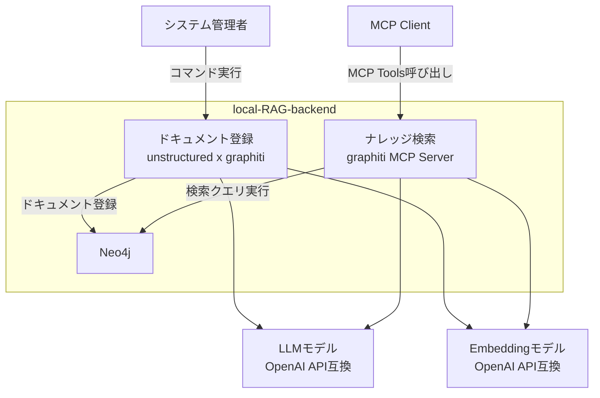

# local-RAG-backend

ローカル環境のdocker composeで完結するRAGシステムのバックエンドです。各種ドキュメントを登録し、MCP serverで検索できます。

## 特徴

- **幅広いファイル形式に対応**: `unstructured`を利用して、PDF、Office、テキスト、画像など28種類のファイル形式に対応しています。
- **MCP検索機能**: `graphiti MCP Server`の実装を流用して、Model Context Protocol対応の検索を提供します。
- **高度なRAG機能**: `graphiti`を利用して、ベクトル検索 + グラフ検索 + 全文検索の結果を、関係性でリランキングした結果を返します。
- **時系列の関係性の変化を追跡**: `graphiti`のエピソード機能で、登録したドキュメント内の概念の関係性の変化を追跡できます。



## Getting Started

### 1. 前提

- **OpenAPI互換のLLM APIが利用できる**
  - 利用するモデル
    - ベクトル検索に利用するEmbeddingモデル
    - グラフ検索に利用するLLMモデル
    - リランキングに利用する軽量なLLMモデル
  - EmbeddingモデルとLLMモデルは、別のURLを指定できます
    - 例:
      - Embeddingモデル: `ローカルのOllama`
      - LMモデル: `OpenAI`
        - グラフ検索: `o4-mini`
        - リランキング: `gpt-4.1-nano`
    - 注意:
      - LLMモデルをローカルのOllamaで利用する場合、フォーマット指定のレスポインスを、数秒で返すパフォーマンスが必要です。
      - OpenRouterは rate limit エラーになりやすいので、ルーティング先を直接指定することをおすすめします。

### 2. インストール

```bash
# 実行ディレクトリの作成
mkdir path/to/RAG/
cd path/to/RAG/

# ファイルのダウンロード
curl -Lo docker-compose.yml https://raw.githubusercontent.com/suwa-sh/local-RAG-backend/refs/heads/main/docker-compose.yml
curl -Lo .env https://raw.githubusercontent.com/suwa-sh/local-RAG-backend/refs/heads/main/.env.example

# 環境変数設定
vi .env

# 起動
docker compose up -d
```

### 3. ドキュメント登録

```bash
# ドキュメントを配置
cp -r /path/to/documents/* path/to/RAG/data/imput/

# 一括登録実行
docker compose run --rm ingest

# ログ確認
tail ./data/logs/ingest-*.log
```

#### サポートファイル形式

| カテゴリ             | 対応形式                             |
| -------------------- | ------------------------------------ |
| **テキスト**         | txt, md, rst, org                    |
| **Web**              | html, xml                            |
| **PDF**              | pdf                                  |
| **Microsoft Office** | doc, docx, ppt, pptx, xls, xlsx      |
| **OpenDocument**     | odt                                  |
| **リッチテキスト**   | rtf                                  |
| **eBook**            | epub                                 |
| **データ**           | csv, tsv                             |
| **メール**           | eml, msg, p7s                        |
| **画像**             | bmp, heic, jpeg, jpg, png, tiff, tif |

### 4. ナレッジ検索

- n8n / AI Agent node や Claude DeskctopなどのMCP Clientから接続

  ```json
  {
    "mcpServers": {
      "graphiti-memory": {
        "transport": "sse",
        "url": "http://localhost:8000/sse"
      }
    }
  }
  ```

#### 利用可能なMCP Tools

```javascript
// RAG用検索
const result = await mcp.call_tool("search_for_rag", {
  query: "RAGシステムについて",
  group_ids: ["default"],
});

// 事実検索
const result = await mcp.call_tool("search_memory_facts", {
  query: "RAGシステムについて",
  group_ids: ["default"],
  max_facts: 10,
});

// ノード検索
const nodes = await mcp.call_tool("search_memory_nodes", {
  query: "システム",
  group_ids: ["default"],
  max_nodes: 5,
});

// エピソード取得
const episodes = await mcp.call_tool("get_episodes", {
  group_id: "default",
  last_n: 10,
});

// エピソード追加
const addResult = await mcp.call_tool("add_memory", {
  name: "新しい情報",
  episode_body: "ここに内容を記述",
  group_id: "default",
  source: "text",
});
```

## 設定

### .envファイルの例

```ini
# Neo4jデータベース
NEO4J_URI=bolt://localhost:7687 # docker composeでは不使用です。定義に合わせて上書きされます。
NEO4J_USER=neo4j
NEO4J_PASSWORD=password

# LLMモデル
LLM_MODEL_URL=https://api.openai.com/v1
LLM_MODEL_NAME=gpt-4o-mini
LLM_MODEL_KEY=your_openai_api_key

# Rerankモデル
RERANK_MODEL_NAME=gpt-4.1-nano

# Embeddingモデル
EMBEDDING_MODEL_URL=http://host.docker.internal:11434/v1
EMBEDDING_MODEL_NAME=kun432/cl-nagoya-ruri-large:latest
EMBEDDING_MODEL_KEY=dummy

# テナント識別子
GROUP_ID=default

# チャンク設定（オプション）
CHUNK_SIZE_MAX=2000
CHUNK_SIZE_MIN=200
CHUNK_OVERLAP=0
```

## 既知の課題

- ナレッジ検索の内部処理の可視化（ログ分析は可能）
