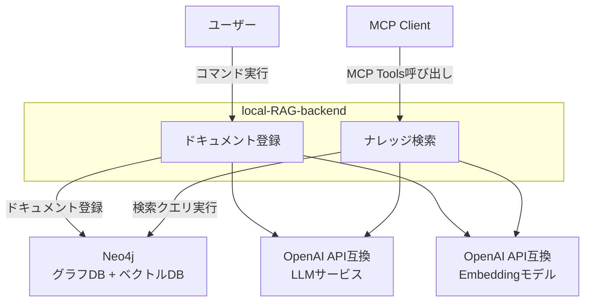

# local-RAG-backend

ローカル環境のdocker composeで完結するRAGシステムのバックエンドです。
各種ドキュメントを登録し、MCP serverで検索できます。

## 特徴

- **28種類のファイル形式に対応**: `unstructured`を利用して、PDF、Office、テキスト、画像など幅広いファイル形式に対応しています。
- **MCP検索機能**: `graphiti memory MCP Server`の実装を流用して、Model Context Protocol対応の検索に対応しています。
- **検索精度を上げる仕組みが組み込み済み**: `graphiti`を利用して、ベクトル検索 x グラフ検索 x 全文検索の結果を、関係性でリランキングした結果を返しています。





## Getting Started

### 1. 前提

- OpenAPI互換のLLM APIが利用できる
  - ベクトル検索に利用するEmbeddingモデル
  - グラフ検索に利用するLLMモデル
  - リランキングに利用する形容なLLMモデル
- EmbeddingモデルとLLMモデルは、別のURLを指定できます
  - 例: 
    - Embeddingモデル: `ローカルのOllama`
    - LLMモデル: `OpenAI`
      - グラフ検索: o4-mini
      - リランキング: gpt-4.1-nano
  - 注意:
    - OpenRouterの場合、rate limitでエラーになることが多いです
    - LLMモデルをローカルのOllamaで利用する場合、フォーマット指定のレスポインスを、数秒で返すパフォーマンスが必要です。

### 2. インストール

```bash
# 実行ディレクトリの作成
mkdir path/to/RAG/
cd path/to/RAG/

# ファイルのダウンロード
curl -Lo docker-compose.yml https://raw.githubusercontent.com/suwa-sh/local-RAG-backend/refs/heads/main/docker-compose.yml
curl -Lo .env https://raw.githubusercontent.com/suwa-sh/local-RAG-backend/refs/heads/main/.env.example

# 環境変数設定
vi .env

# 起動
docker compose up -d
```

### 3. ドキュメント登録

```bash
# ドキュメントを配置
cp -r /path/to/documents/* path/to/RAG/data/imput/

# 一括登録実行
docker compose run --rm ingest

# ログ確認
tail ./data/logs/ingest-*.log
```

### 4. ナレッジ検索

- n8n / AI Agent node や Claude DeskctopなどのMCP Clientから接続

    ```json
    {
        "mcpServers": {
            "graphiti-memory": {
                "transport": "sse",
                "url": "http://localhost:8000/sse"
            }
        }
    }
    ```

**利用可能なMCP Tools**:

```javascript
// 事実検索（メイン機能）
const result = await mcp.call_tool("search_memory_facts", {
    query: "RAGシステムについて",
    group_ids: ["default"],
    max_facts: 10
});

// ノード検索  
const nodes = await mcp.call_tool("search_memory_nodes", {
    query: "システム",
    group_ids: ["default"],
    max_nodes: 5
});

// エピソード取得
const episodes = await mcp.call_tool("get_episodes", {
    group_id: "default",
    last_n: 10
});

// エピソード追加
const addResult = await mcp.call_tool("add_memory", {
    name: "新しい情報",
    episode_body: "ここに内容を記述",
    group_id: "default",
    source: "text"
});
```

## 設定

### .envファイルの例

```ini
# Neo4jデータベース
NEO4J_URL=bolt://localhost:7687
NEO4J_USER=neo4j
NEO4J_PASSWORD=password

# LLMモデル
LLM_MODEL_URL=https://api.openai.com/v1
LLM_MODEL_NAME=gpt-4o-mini
LLM_MODEL_KEY=your_openai_api_key

# Rerankモデル
RERANK_MODEL_NAME=gpt-4.1-nano

# Embeddingモデル
EMBEDDING_MODEL_URL=http://localhost:11434/v1
EMBEDDING_MODEL_NAME=kun432/cl-nagoya-ruri-large:latest
EMBEDDING_MODEL_KEY=dummy

# テナント識別子
GROUP_ID=default

# チャンク設定（オプション）
CHUNK_SIZE_MAX=2000
CHUNK_SIZE_MIN=200
CHUNK_OVERLAP=0
```

### サポートファイル形式

| カテゴリ             | 対応形式                             |
| -------------------- | ------------------------------------ |
| **テキスト**         | txt, md, rst, org                    |
| **Web**              | html, xml                            |
| **PDF**              | pdf                                  |
| **Microsoft Office** | doc, docx, ppt, pptx, xls, xlsx      |
| **OpenDocument**     | odt                                  |
| **リッチテキスト**   | rtf                                  |
| **eBook**            | epub                                 |
| **データ**           | csv, tsv                             |
| **メール**           | eml, msg, p7s                        |
| **画像**             | bmp, heic, jpeg, jpg, png, tiff, tif |


## 既知の課題

- モニタリングの仕組みが考慮されていない
  - 検索の内部でなにが起きているかを可視化する仕組みが必要
